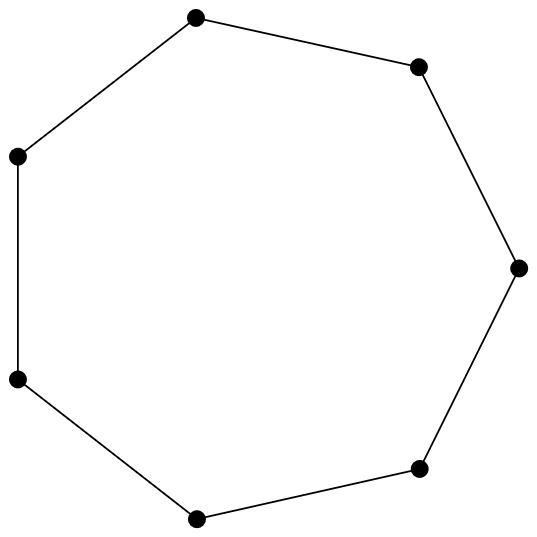
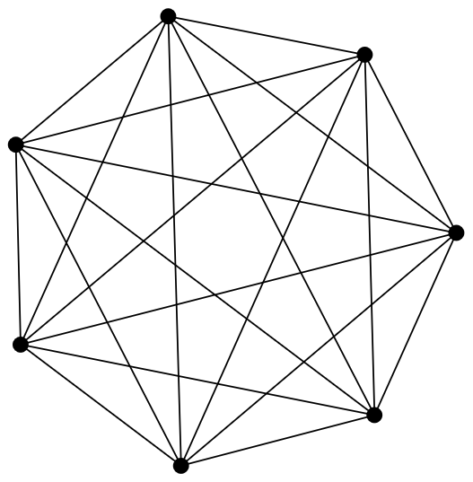

# Rediscovering Brook's theorem

For this example, we will demonstrate how GraphQuest can be used to explore datasets to try to discover new results, as well as to rediscover existing theorems, in this case we will look at Brooks' theorem.

**Brook's theorem**\
Let \\(G=(V,E)\\) be a connected graph with \\(\Delta\\) being its maximum degree. If \\(G\\) is neither complete nor an odd cycle, then:
\\[\chi(G) \leq \Delta,\\]
else:
\\[\chi(G) = \Delta + 1.\\]


Suppose, for the purpose of this example, that this theorem had not yet been proven and that we wanted to see whether it holds for the graphs in our dataset.


Let us try to find the graph which have a \\(\chi(G)\\) strictly superior to \\(\Delta\\) in our dataset using the following command:
```bash
gquest q "is_connected -> chromatic_nb > max_degree" -p 3:3
```
which results in:

| **i** | **sig** | **max_degree** | **chromatic_nb** |
| ----- | ------- | -------------- | ---------------- |
| 0     | @       | 0              | 1                |
| 1     | A_      | 1              | 2                |
| 2     | Bw      | 2              | 3                |
| ...   | ...     | ...            | ...              |
| 7     | FoDPO   | 2              | 3                |
| 8     | F~~~w   | 6              | 7                |
| 9     | G~~~~{  | 7              | 8                |

As you can see, there are 10 graphs fitting these criteria. 

In order to better analyse the results, let us restrict the search to graphs with seven vertices:
```bash
gquest q "n == 7 -> is_connected -> chromatic_nb > max_degree" -c
```
which gives:
| **i** | **sig** | **max_degree** | **chromatic_nb** |
| ----- | ------- | -------------- | ---------------- |
| 0     | FoDPO   | 2              | 3                |
| 1     | F~~~w   | 6              | 7                |

And let us observe them, using House of Graphs:
<table align="center">
  <tr>
    <td align="center">
      
      <br>
      <em>FoDPO</em>
    </td>
    <td align="center">
      
      <br>
      <em>F~~~w</em>
    </td>
  </tr>
</table>


This two graphs are interesting because one is a cycle, while the other is a complete graph. 

This could suggest that all graphs have a chromatic number less or equal to their maximum degree unless they are complete or a cycle.


Let us explore this on our entire dataset, by using the command:
```bash
gquest query "is_connected -> chromatic_nb > max_degree" -a "n;is_complete;is_cycle" -r
```
which results in:
| **i** | **sig** | **n** | **is_complete** | **is_cycle** |
| ----- | ------- | ----- | --------------- | ------------ |
| 0     | @       | 1     | 1               | 0            |
| 1     | A_      | 2     | 1               | 0            |
| 2     | Bw      | 3     | 1               | 1            |
| 3     | C~      | 4     | 1               | 0            |
| 4     | DqK     | 5     | 0               | 1            |
| 5     | D~{     | 5     | 1               | 0            |
| 6     | E~~w    | 6     | 1               | 0            |
| 7     | FoDPO   | 7     | 0               | 1            |
| 8     | F~~~w   | 7     | 1               | 0            |
| 9     | G~~~~{  | 8     | 1               | 0            |


Here we can notice a pattern.

It seems that the every graph in the dataset for which
\\[
\chi(G) > \Delta
\\]
is either:
* a complete graph, or
* a cycle.

Furthermore, due to the absence of cycles with an even order, it seems like only odd cycles have a \\(\chi(G)\\) strictly greater than \\(\Delta\\).


This is precisely Brooks' theorem.


But just to be sure, let us try this result on our dataset by executing the following query which should not return any graph:
```bash
gquest q "is_connected -> chromatic_nb <= max_degree or (is_complete or (is_cycle and n % 2 == 1))" -c
```
And indeed, this query results in the following table:
| Empty table |
|-------------|
|      /      |

Meaning, unsurprisingly, that the theorem is verified on our dataset.