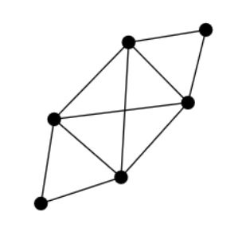
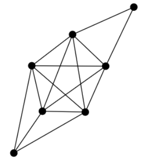
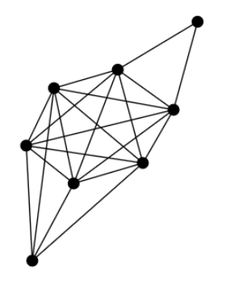
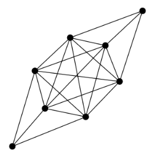
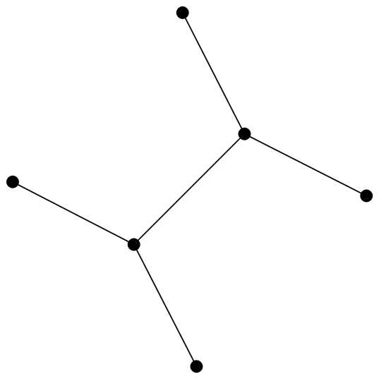
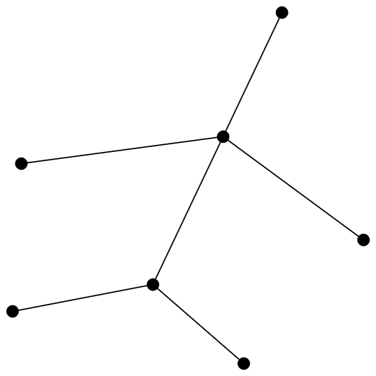
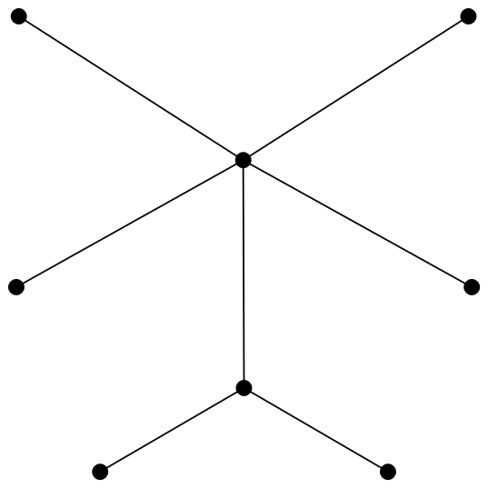
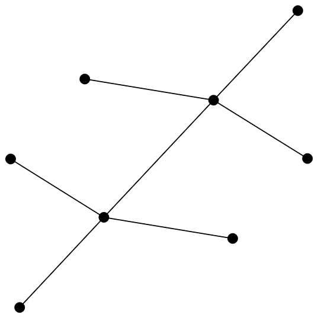

# Refuting a conjecture

In this section, we will examine a conjecture which can found in the paper called "On the maximal eccentric connectivity indices of graphs"[^fn1] published in 2014 and written by Zhang Jian-bin, Liu Zhong-zhu and Zhou Bo.

## Definitions

> Let \\(n\\) and \\(m\\) be two positive integers, with \\(n-1 \\leq m \\leq \\binom{n}{2}\\), then we define \\(d_{n,m}\\) as the result of:
> \\[
>     \left\lfloor{\frac{2n+1-\sqrt{17+8(m-n)}}{2}}\right\rfloor.
> \\]


> Let \\(n\\) and \\(m\\) be two positive integers, with \\(n-1 \\leq m \\leq \\binom{n}{2}\\), then we define \\(E_{n,m}\\) as the graph obtained from a path \\(P_{d_{n,m}+1}=v_0v_1\cdots v_{d_{n,m}}\\) by joining each vertex of \\( K_{n- (d_{n,m}) - 1} \\) to both \\(v_{d_{n,m}}\\) and \\(v_{d_{n,m}-1}\\), and by joining \\(m-n+1-\binom{n-d_{n,m}}{2}\\) vertices of \\(K_{n-(d_{n,m})-1}\\) to \\(v_{d_{n,m}-2}\\)


The authors then leave open the following conjecture:

> **Conjecture**\
> Let \\(d_{n,m} \geq 3\\), then \\(E_{n,m}\\) is the unique graph with maximal eccentric connectivity index among all connected graphs with \\(n\\) vertices and \\(m\\) edges.

Let us try to disprove it using GraphQuest.


## Creating the dataset

For this section, we will use the database utilised in the example about [Brooks' theorem](brooks.md), for which we already defined a [dataset](brooks.md#creating-the-dataset).


## Preparing the modules

For this example, we will need more modules than before.

Let \\(G\\) and \\(H\\) be two graphs, then:
* `n(G)`: is the order of \\(G\\);
* `m(G)`: is the size of \\(G\\);
* `d(n,m)`: is the value of \\(d_{n,m}\\);
* `E(n,m)`: is the value of \\(E_{n,m}\\);
* `eci(G)`: is the value of \\(\xi^c(G)\\);
* `min_degree(G)`: is the value of the minimum degree, \\(\delta\\), of \\(G\\);
* `is_connected(G)`: is equal to 1 if \\(G\\) is connected, 0 otherwise; and
* `iso(G,H)`: is equal to 1 if \\(G \simeq H\\), 0 otherwise;


Then for this section we could re-use the previous configuration file, `configs.json`, and simply add the additional modules needed, but to keep this section from being too bloated we will omit them.

```json
{
  "batch_size": 6500,
  "modules": [
    {
      "function": "n",
      "path": "modules/order.py",
      "args": [
        {
          "name": "sig",
          "class": "graph"
        }
      ],
      "output": "numeric"
    },
    {
      "function": "m",
      "path": "modules/edges.py",
      "output": "numeric"
    },
    {
      "function": "d",
      "path": "modules/d_nm.py",
      "args": [
        {
          "name": "n",
          "class": "numeric"
        },
        {
          "name": "m",
          "class": "numeric"
        }
      ],
      "output": "numeric"
    },
    {
      "function": "E",
      "path": "modules/e_nm.py",
      "args": [
        {
          "name": "n",
          "class": "numeric"
        },
        {
          "name": "m",
          "class": "numeric"
        }
      ],
      "output": "graph"
    },
    {
      "function": "eci",
      "path": "modules/eci.py",
      "output": "numeric"
    },    
    {
      "function": "min_degree",
      "path": "modules/min_degree.py",
      "output": "numeric"
    },
    {
      "function": "is_connected",
      "path": "modules/is_connected.py",
      "output": "numeric"
    },
    {
      "function": "iso",
      "path": "modules/iso.py",
      "args": [
        {
          "name": "g1",
          "class": "graph"
        },
        {
          "name": "g2",
          "class": "graph"
        }
      ],
      "batch_size": 5000,
      "output": "numeric"
    }
  ]
}
```

Once again, the implementation of these modules can be found in the module examples repository.


> [!tip]
> Here we decided to use a module to compute the value of \\(d_{n,m}\\) in order to keep the future queries legible. 
> 
> However, we can also compute this value using the following mathematical expression:
> `floor((2*n+1-sqrt(17+8*(m-n)))/2)`.
 
Now that we have everything we need, we can start the search for counterexamples.

## Finding counterexamples

To find a counterexample to this conjecture, we need to find a graph \\(G\\) with order \\(n\\) and size \\(m\\) such that:
* \\(n-1 \\leq m \\leq \\binom{n}{2}\\);
* \\(G\\) is connected;
* \\(d_{n,m} \geq 3\\);
* \\(G\\) has the maximum eccentric connectivity index among all connected graphs with \\(n\\) vertices and \\(m\\) edges; and
* \\(G \not\simeq E_{n,m}\\).

In other words, a counterexample is a connected graph \\(G\\) that respects the given preconditions and achieves the same maximum eccentric connectivity index as \\(E_{n,m}\\), while being non-isomorphic to \\(E_{n,m}\\).


We can easily find a graph fitting these criteria using the modules we defined in our  configuration file alongside the following query:
```bash
gquest q "n-1 <= m <= n*(n-1)/2 -> is_connected -> d(n,m) >= 3 -> max(eci;m,n) -> not iso(G, E(n,m))" -a "eci(G)"
```
which outputs the following data:
| **i** | **sig**   | **m** | **n** | **E(n,m)** | **iso(G,E(n,m))** | **eci** |
| ----- | --------- | ----- | ----- | ---------- | ----------------- | ------- |
| 0     | ET\\w     | 10    | 6     | Eh\\w      | 0                 | 44      |
| 1     | FJ]\|w    | 15    | 7     | Fh\\zw     | 0                 | 65      |
| 2     | GJ\\\|\|{ | 21    | 8     | Gh\\zz{    | 0                 | 90      |
| 3     | GTlzz{    | 21    | 8     | Gh\\zz{    | 0                 | 90      |

This means that we found four counterexamples !

Let us visualise them, using House of Graphs:
<table align="center">
  <tr>
    <td align="center">
      
      <br>
      <em>ET\w</em>
    </td>
    <td align="center">
      
      <br>
      <em>FJ]|w</em>
    </td>
    <td align="center">
      
      <br>
      <em>GJ\||{</em>
    </td>
    <td align="center">
      
      <br>
      <em>GTlzz{</em>
    </td>
  </tr>
</table>

As you can see they seem to be part of the same class of graphs.


### Classifying our counterexamples

We will now attempt to classify our examples in order to alter the original conjecture.

#### As complete-but-two graphs

We can classify this set of graphs using the following definition:

**Complete-but-two**\
Let \\(n\\) and \\(\delta\\) be two positive integers, with \\(n \geq 6\\) and \\(\delta \geq 2\\). We define the complete-but-two graph \\(n,\delta\\), denoted by \\(CBT_{n,\delta}\\), as the graph obtained from a complete graph \\(K_{n-2}\\) by joining two vertices \\(a\\) and \\(b\\) such that they are non-adjacent, share no common neighbours:
* \\(d(a) = \delta\\), and
* \\(d(b) = n - \delta - 2\\).

Furthermore, one can prove that the size of a graph \\(CBT_{n,\delta}\\) is:
\\[m = \frac{n^2 - 3n + 2}{2}.\\]

> We can verify that this is the case on our set of counterexamples:
> ```bash
> gquest q "n-1 <= m <= n*(n-1)/2 and is_connected -> d(n,m) >= 3 -> max(eci;m,n) -> not iso(G, E(n,m))" -r -a "m;(n**2-3*n+2)/2"
> ```
> 
> | **i** | **sig**   | **m** | **(((n ** 2) - (3 * n)) + 2) / 2** |
> | ----- | --------- | ----- | ---------------------------------- |
> | 0     | FJ]\|w    | 15    | 15                                 |
> | 1     | ET\\w     | 10    | 10                                 |
> | 2     | GTlzz{    | 21    | 21                                 |
> | 3     | GJ\\\|\|{ | 21    | 21                                 |


Note that \\(\delta\\) is the value of the minimum degree in \\(CBT_{n, \delta}\\).


Finally, we propose the following theorem.

**Theorem**\
Let \\(CBT_{n,\delta}\\) be a complete-but-two graph, then we have that:
\\[
  \xi^c(CBT_{n,\delta}) = \xi^c\left(E_{n, \frac{n^2 - 3n + 2}{2}}\right) = 2n^2 - 5n + 2,
\\]
with \\(CBT_{n,\delta} \not\simeq E_{n, \frac{n^2 - 3n + 2}{2}}\\)


> Once again, let us verify this theorem on our counterexamples:
> ```bash
> gquest q "n-1 <= m <= n*(n-1)/2 and is_connected -> d(n,m) >= 3 -> max(eci;m,n) -> not iso(G, E(n,m))" -r -a "eci(G); 2*n**2 - 5*n + 2" 
> ```
> | **i** | **sig**   | **eci** | **((2 * (n ** 2)) - (5 * n)) + 2** |
> | ----- | --------- | ------- | ---------------------------------- |
> | 0     | FJ]\|w    | 65      | 65                                 |
> | 1     | ET\\w     | 44      | 44                                 |
> | 2     | GTlzz{    | 90      | 90                                 |
> | 3     | GJ\\\|\|{ | 90      | 90                                 |


Let us exclude this category of graph from our query result and see if we find any other results.

```bash
gquest q "n-1 <= m <= n*(n-1)/2 and is_connected -> d(n,m) >= 3 -> max(eci;m,n) -> iso(G, E(n,m)) or m == (n**2 - 3*n +2)/2" -c
```

| Empty table |
| ----------- |
| /           |

Since we didn't find any other counterexamples, we can modify the original conjecture to include this class of graphs.


> **New conjecture**\
> Let \\(d_{n,m} \geq 3\\), then \\(E_{n,m}\\) is the unique graph with maximal eccentric connectivity index among all connected graphs with \\(n\\) vertices and \\(m\\) edges except if \\(m= \frac{n^2 - 3n + 2}{2}\\).


#### As complement of double star graphs

Sometimes it can be useful to visualise the complement of a graph to see if it they are part of an already well known class.

To get the complement of the resulting graphs we can simply use the following command:  
```bash
gquest q "n-1 <= m <= n*(n-1)/2 and is_connected -> d(n,m) >= 3 -> max(eci;m,n) -> not iso(G, E(n,m))" -r -a "comp(G); min_degree(G)"
```
which results in:
| **i** | **sig**   | **comp** | **min_degree** |
| ----- | --------- | -------- | -------------- |
| 0     | ET\\w     | Eia?     | 2              |
| 1     | FJ]\|w    | Fs`A?    | 2              |
| 2     | GJ\\\|\|{ | GsaAA?   | 2              |
| 3     | GTlzz{    | GiQCC?   | 3              |

Let us visualise them:
<table align="center">
  <tr>
    <td align="center">
      
      <br>
      <em>Eia?</em>
      <br>
      <em>\(S_{2,2}\)</em>
    </td>
    <td align="center">
      
      <br>
      <em>Fs`A?</em>
      <br>
      <em>\(S_{2,3}\)</em>
    </td>
    <td align="center">
      
      <br>
      <em>GsaAA?</em>
      <br>
      <em>\(S_{2,4}\)</em>
    </td>
    <td align="center">
      
      <br>
      <em>GiQCC?</em>
      <br>
      <em>\(S_{3,3}\)</em>
    </td>
  </tr>
</table>

As we can see, these graphs are actually double star graphs.


> The *double star* \\(S_{k_1, k_2}\\), for \\(k_1, k_2 > 0\\), is the tree obtained from an edge by attaching \\(k_1\\) leaves to one endpoint and \\(k_2\\) leaves to the other endpoint.


One can prove that a \\(CBT_{n,\delta}\\) graph is the complement of the double star graph \\(S_{\delta,n-\delta - 2}\\).

##### Adding new modules

In order to continue, we have to add two new modules which, instead of returning a numerical value like before, will return another graph.

Let \\(G\\) be a graph, then:
* `comp(G)`: is the complement of \\(G\\), denoted by \\(\overline{G}\\); and
* `double_star(k1,k2)`: is the double star \\(S_{k1, k2}\\);

```json
{
  "batch_size": 6500,
  "modules": [
    ...
    {
      "function": "comp",
      "path": "modules/complement.py",
      "output": "graph"
    },
    {
      "function": "double_star",
      "path": "modules/double_star.py",
      "args": [
        {
          "name": "k1",
          "class": "numeric"
        },
        {
          "name": "k2",
          "class": "numeric"
        }
      ],
      "output": "graph"
    },
  ]
}
```

##### Altering the conjecture

Let us exclude this class of graphs from our query result and see if we find any other results:
```bash
gquest q "n-1 <= m <= n*(n-1)/2 and is_connected -> d(n,m) >= 3 -> max(eci;m,n) -> iso(G, E(n,m)) or iso(comp(G), double_star(min_degree, n-min_degree-2))" -c 
```
The previous query results in:
| Empty table |
| ----------- |
| /           |

Since, once again we didn’t find any other counterexamples, we can modify the original conjecture to include this class of graphs.
> **New conjecture**\
> Let \\(d_{n,m} \geq 3\\), then \\(E_{n,m}\\) is the unique graph with maximal eccentric connectivity index among all connected graphs with \\(n\\) vertices and \\(m\\) edges except if \\(G \simeq \overline{S_{\delta,n-\delta - 2}}\\), with \\(\delta\\) the minimum degree of \\(G\\).


### Disproving the new conjectures


By using `gquest`, we already verified that our new conjectures hold for graphs with an order of at most 8.

We can extend our dataset to include the graphs of order 9 and 10 using the following command:
```bash
gquest a g 9,10
```

And we can then use the exact same commands as before.
But of course, it will take more time to compute any results due to the gigantic size of the database. But if we wait long enough, we will see that our conjectures are verified for graphs with an order of at most 10.


We now invite the readers to try to refute or to prove the given conjectures with the help of GraphQuest for graphs with an higher order.


[^fn1]: Zhang, J. B., Liu, Z. Z., & Zhou, B. (2014). On the maximal eccentric connectivity indices of graphs. Applied Mathematics-A Journal of Chinese Universities, 29(3), 374-378.