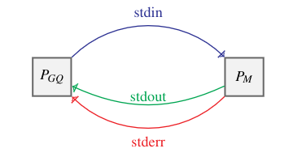

# Modules

As explained in the previous section, modules are files that can be executed so we will refer to the process resulting
from the execution of a module \\(M\\) as \\(P_M\\). And like for any process, \\(P_M\\) has three input/output
communication channels, each with a different purpose:
* a standard input, called the stdin, which is stream of data containing PM ’s input;
* a standard output, called stdout, which is the stream where PM writes its outputted data; and
* a standard error, called stderr, which is stream where PM writes its diagnostics or the errors
it faces.


Another process can be at the other end of these channels to communicate with \\(P_M\\) , which is what
GraphQuest’s process \\(P_{GQ}\\) does as shown by the following figure:
<p align="center">
  
</p>


## Communications with GraphQuest

Suppose that the module \\(M\\) as \\(k\\) arguments, with \\(k \geq 0\\).

GraphQuest will input data by writing lines to \\(P_M\\)' stdin, each one formatted like this:
```
argument_0 ... argument_k−1
```
where each value is separated by a whitespace character. Then \\(P_M\\), upon receiving this line should
write to its standard output a line containing all computed data for this given signature formatted
like this:
```
argument_0 ... argument_k−1 output
```

where once again each value is separated by a whitespace character. Note that if \\(P_{GQ}\\) receives a
different number of outputs than the one expected, if the format is not respected, or if one of the
outputted values is not of the expected type, it will raise throw an exception and stop its execution.


> 
Additionally, if at any point an error arises from \\(P_M\\)' side, it can send it to \\(P_{GQ}\\) by writing it to the
stderr channel, which will signal GraphQuest to report the error to the user and cease its execution.


## Implementing modules

Now that we know how GraphQuest communicates with a module, let us see how to implement
one. For a module to be compatible with GraphQuest, it should follow the subsequent steps:
1. Wait for a line \\(l\\) to be read in the stdin.
2. Get the arguments from \\(l\\).
3. Compute a value using those arguments.
4. Write the arguments alongside the computed value to the stdout as a line and flush often.
5. If the stdin of the process is still open, go back to step 2.
6. Else exit the process.


## Example: creating a python module

Let us implement a module that will check whether two graphs \\(G\\) and \\(H\\) are isomorphic or not, i.e. \\(G \stackrel{?}{\simeq} H\\). Suppose that we will name this file `iso.py` and store it in a directory named "*modules*" located in the current directory.

```
.
├── configs.json
├── env
│   └── ...
└── modules
    └── iso.py
```


To create this module, we can take advantage of Python’s [networkx](https://networkx.org/en/) library which provides useful
methods related to graphs. Such as the [from_graph6_bytes(S)](https://networkx.org/documentation/stable/reference/readwrite/generated/networkx.readwrite.graph6.from_graph6_bytes.html) method that can translate a given
signature \\(S\\) into a graph \\(G\\), or the method [is_isomorphic(G1,G2)](https://networkx.org/documentation/stable/reference/algorithms/generated/networkx.algorithms.isomorphism.is_isomorphic.html) that returns True if \\(G1 \simeq G2\\), False oth-
erwise.


```py
#! /usr/bin/env python
"""Checks if two graphs are isomorphic"""
import sys
import networkx as nx

for sig1, sig2 in map(str.split, map(str.strip, sys.stdin)):
    G1 = nx.from_graph6_bytes(sig1.encode("utf-8"))
    G2 = nx.from_graph6_bytes(sig2.encode("utf-8"))

    print(sig1, sig2, int(nx.is_isomorphic(G1, G2)), flush=True)
```

> [!note]
> Remark that python files are not usually executable but can become so. 
> 
> For example, on a Unix system we can do it in two steps by:
> * turning the file executable, using the command "chmod +x module.py" for example;
> and by
> * adding a Shebang Line, which are lines starting with "#!" and that are placed as the first line
> of a text file to specify that it is a script and not a binary file. Then the rest of the line specifies
> the path of the program to execute the script with

So since we already added the shebang line in our example, we just have to make it executable:
```bash
chmod +x modules/iso.py
```

Let us try the following command:
```bash
printf "A~ BG\nCR Ck" | ./modules/iso.py 
```
which should output
```
A~ BG 0
CR Ck 1
```


We will see in the next section how we can define this function in a configuration file in order to use it in future queries.